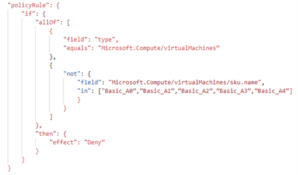
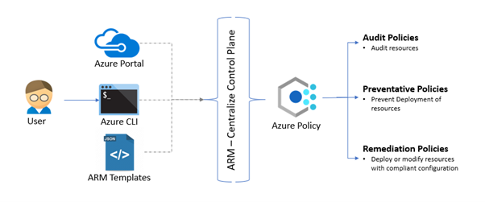
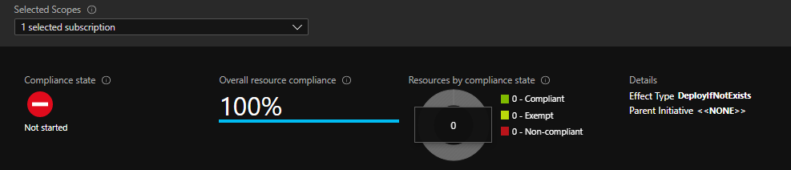

# Azure Policy
Azure Policy is created to assess and enforce enterprise-wide governing standards on large Azure environments. The Azure policy is free services from Azure which help to set up different policies, assign them at different scope like resources, resource groups, management groups. Through its compliance dashboard, it provides the visibility around the compliant and non-compliant resources w.r.t to policies configured in the environment. It also helps to remediate the non-compliant resources.

The basic building block of Azure policy is Policy definition which describes the resource configurations checks and action to be taken case resource is non-compliant in JSON formatted code.

For example, the below policy helps to prevent the creation of virtual machines with basic A0 to A4 SKUs.



Azure policy is in the form of condition and effect. If block contains different compliance conditions and then block contains the effect of the policy. There are different effects that are supported by Azure Policies like Audit, AuditIfNotExists, Deny, DeployIfNotExists, Append, Modify, etc.

Generally, Azure policies are differentiated into main 3 categories depending on the effect/actions of the policy.

* Audit Policies - The policy with Audit and AuditIfNotExists effect falls under this category. It just audits the resources for configurations and shows the compliant and non-compliant resources. For e.g. If you want to just audit all the VMs that do not use managed disks.

* Preventative Policies - The policy with the Deny effect considered as preventative policies. It helps to set up policies that do not allow resource creation if resources are not compliant with the checks of the policies. E.g. If you do not want to allow users to provision any resources in the West US region then you use the policy with Deny effect.

* Remediation Policies - The policies with DeployIfNotExists, Append, or Modify considered as remediation policies as it performs the remediation action in case resource is non-compliant. E.g. “Deploy Log Analytics agent for Windows VMs” policy deploys the log analytics agent whenever the user creates a windows VM within the Azure environment.

## How Azure Policy works?
Azure policy framework act as gatekeeper whenever the user performs provisioning or configuration change on Azure resources. The provisioning or configuration requests performed by the user using a portal, CLI, or ARM template deployments are going to ARM centralize control plane where all the policies which are configured in Azure environments are evaluated against the resources in consideration. Depending on the evaluation results and effects of the policies necessary actions are taken on the resources like audit, prevent any resource from deployment or perform resource deployment to add compliant configurations.



## Azure Policy Key Concepts/Components
### 1. Policy Definition 
Every policy definition has conditions under which it is enforced. And, it has an accompanying effect that takes place if the conditions are met.
### 2. Policy Assignment 
A policy assignment is a policy definition that has been assigned to take place within a specific scope. This scope could range from a management group to a resource group. The term scope refers to all the resource groups, subscriptions, or management groups that the policy definition is assigned to. Policy assignments are inherited by all child resources. This means that if a policy is applied to a resource group, it is applied to all the resources in that resource group. However, you can exclude a sub-scope from the policy assignment. 
### 3. Policy Parameters
Policy parameters help simplify your policy management by reducing the number of policy definitions you must create. You can define parameters when creating a policy definition to make it more generic. Then you can reuse that policy definition for different scenarios. You do so by passing in different values when assigning the policy definition. For example, specifying one set of locations for a subscription.

> A policy re-evaluation happens about once an hour, which means that if you make changes to your policy definition after implementing the policy (creating a policy assignment) it will be re-evaluated over your resources within the hour.

## Azure Policy Definition Structure
[Policy definition template](https://docs.microsoft.com/en-us/azure/templates/microsoft.authorization/policydefinitions?tabs=json)

### Mode
Mode is configured depending on if the policy is targeting an Azure Resource Manager property or a Resource Provider property. When applied for Resource Manager, it determines what type of resources will be evaluated against azure policy. The supported modes are:
* all – Evaluate Resource Groups and all resource types
* indexed – Evaluate Only Resource types which supports usage of tags and locations.
* More are getting added like Microsoft.KeyVault.Data, etc

The preferred value to be used should be all in most of the cases. All policy definitions created through the portal use the all mode. If the policy definition doesn’t include a mode value, it defaults to all in Azure PowerShell and to null in Azure CLI. A null mode is the same as using indexed to support backwards compatibility.

### Parameters
Parameters help simplify the policy management by reducing the number of policy definitions. By making use of parameters, you can re-use azure policy and supply different values according to the different scenarios.

In this case, by defining parameter for list of allowed locations, it will allow users to provide location when applying Azure Policy. One can also set defaultValue and allowedValues for the parameter. This helps in removing errors while supplying the value of the parameter.

For example, we can specify that the defaultValue is “eastus” and allowedValues are eastus, eastus2, westus, westus2.

## Example: Azure Policy to update Key Vault access policies  
In this example, a security group will be added using Azure Policy to any Key Vault provisioned within a resource group in a subscription. The ObjectId of the security group is passed as a parameter to the policy assignment.
### 1. Create a policy definition
The policy definition is created using a JSON file. The complete policy definition is for this policy is present in this file 
* updateKeyVaultAccessPolicy.json

Improvise on the Azure Policy by referring the one provided here: 
* [Enable soft-delete and purge protection on Key Vaults](https://github.com/Azure/Community-Policy/tree/master/Policies/KeyVault/deploy-soft-delete-and-purge-protection)
* [Azure policy to append/replace accessPolicy entries on vaults](https://github.com/Azure/azure-policy/issues/333)

This file can be uploaded directly on Azure Portal. For creating the policy using Azure CLI, the rules & parameters are to be passed separately as files to the CLI. The rules & parameters in this case are contained in 
* updateKeyVaultAccessPolicy.rules.json
* updateKeyVaultAccessPolicy.parameters.json.

The policy will accept a parameter, which is the object id of the Service Principal or Security group, which will be granted List access to the Secrets object store in key vault.
```bash
# Create a policy definition
policyName=add-keyvault-accesspolicy
rules=updateKeyVaultAccessPolicy.rules.json
parameters=updateKeyVaultAccessPolicy.parameters.json
# Create a custom policy by passing the rules & parameters json file
az policy definition create --name $policyName \
    --display-name 'Add service principal or security group to Key Vault' \
    --rules $rules --params $parameters \
    --mode all --verbose 
```
### 2. Create an assignment
```bash
# The assignment scope in this case is the resource group
rgName=rg-demo
scope=$(az group show -n $rgName | jq -r ".id")

# Create a security group which will be passed as parameter
az ad group create --display-name akv-azpolicy --mail-nickname akv-azpolicy
# Get the Object id of the security group to be passed as parameter
az ad group show --group akv-azpolicy | jq -r ".objectId"
# Update the parametersValueAssignment.json with the ObjectId
# Assign the above created policy to the resource group rg-demo 
paName=kv-accesspolicy
az policy assignment create --name $paName \
    --display-name $policyName \
    --scope $scope --policy $policyName \
    --params parametersValueAssignment.json \
    --assign-identity --location canadacentral \
    --identity-scope $scope --role Contributor
```
After the policy assignment, initially it will look like this. The policy compliance scan will run in few minutes & show the appropriate status.


The policy can also be triggered on demand
```bash
# Run policy scan on demand
az policy state trigger-scan --resource-group $rgName --debug
```

> By default, assignment will only take effect on newly created resources. Existing resources can be updated via a remediation task after the policy is assigned. 

Create a policy remediation task
```bash
paId=$(az policy assignment show -n $paName --scope $scope | jq -r ".id")
# Create policy remediation task
az policy remediation create -g $rgName -n remediationTask \
    --policy-assignment $paId --debug
```

### 3. Test the policy assignment
```bash
# Create a Key Vault in the resource group
kvName=kv-azurepolicydemo
rgName=rg-demo
location=canadacentral
az keyvault create -n $kvName -g $rgName -l $location --no-wait --verbose
# Run the watch command to see when the policy takes effect
time watch -d -g -n 5 "az keyvault show -n $kvName \
    --query '{Name:name, SecretsPermissions:properties.accessPolicies[].permissions.secrets[]}'"
real    10m11.042s
user    1m16.516s
sys     0m8.505s
# The above command will show the time taken for the policy to update the key vault with the access policies.
# In this case, it took 10 min 11 seconds.
```
DeployIfNotExists runs about 15 minutes after a Resource Provider has handled a create or update subscription or resource request and has returned a success status code.

When a new Key Vault is created, the Azure Policy will scan the resource & find that the Security Group object id is not present in the access policy. It will mark it as non-compliant stating "No related resources match the effect details in the policy definition: Resource Not Found". It will then add the Security Group to the access policy for the key vault.

## References
* [Understand Azure Policy effects](https://docs.microsoft.com/en-us/azure/governance/policy/concepts/effects)
* [Remediate non-compliant resources with Azure Policy](https://docs.microsoft.com/en-us/azure/governance/policy/how-to/remediate-resources)
* [Enable soft-delete and purge protection on Key Vaults](https://github.com/Azure/Community-Policy/tree/master/Policies/KeyVault/deploy-soft-delete-and-purge-protection)
* [Azure policy to append/replace accessPolicy entries on vaults](https://github.com/Azure/azure-policy/issues/333)
